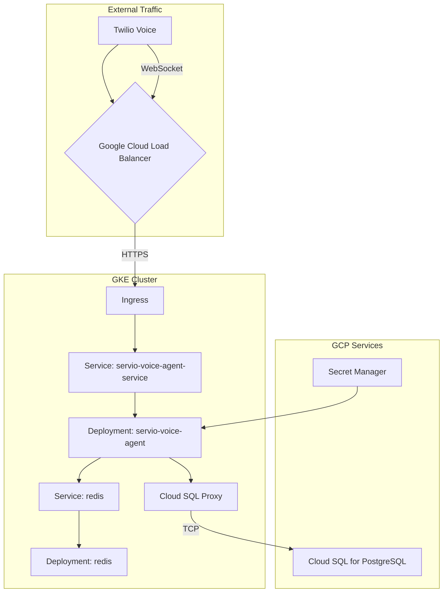

# Google Cloud Platform (GCP) Configuration Guide

This document provides a comprehensive overview of the application's architecture and configuration on Google Cloud Platform, focusing on Google Kubernetes Engine (GKE) and its integration with other GCP services.

## 1. Architecture Overview

The application is deployed on GKE and is composed of several interconnected components that work together to handle voice calls, manage application state, and process data.



### Component Summary:

- **Google Cloud Load Balancer (GCLB)**: The entry point for all external traffic, configured via a GKE Ingress. It handles SSL termination and routes traffic to the application service.
- **GKE Ingress**: Manages the GCLB and defines routing rules. It directs traffic for `api.serviio.ai` to the `servio-voice-agent-service`.
- **GKE Service (`servio-voice-agent-service`)**: Exposes the application pods to the network and connects them to the Ingress. It also applies backend configuration for custom timeouts.
- **GKE Deployment (`servio-voice-agent`)**: Manages the application pods, ensuring the desired number of replicas are running. It defines the container image, ports, and environment variables.
- **Redis**: A in-cluster Redis instance used for ephemeral state management, such as storing active call information.
- **Cloud SQL for PostgreSQL**: The primary database for persistent data storage, such as call logs and order information.
- **Cloud SQL Proxy**: A sidecar container in the application deployment that provides secure access to the Cloud SQL instance.
- **Secret Manager**: Securely stores and manages sensitive information, such as API keys and database credentials.

## 2. GKE Deployment (`k8s_deployment.yaml`)

The application is deployed on GKE using a Deployment resource, which ensures that a specified number of pod replicas are running and manages their lifecycle.

- **Replicas**: The deployment is configured to run **2 replicas** for high availability.
- **Container Image**: The application runs in a container built from the `us-central1-docker.pkg.dev/serviio-voice/servio-voice-agent-repo/servio-voice-agent:latest` image.
- **Environment Variables**:
  - `PUBLIC_BASE_URL`: Set to `https://api.serviio.ai` to ensure correct URL construction for external services like Twilio.
  - Other environment variables are loaded from a Kubernetes secret named `servio-env`, which is populated by Google Secret Manager.
- **Cloud SQL Proxy**: A sidecar container (`cloud-sql-proxy`) is included in the deployment to provide a secure connection to the Cloud SQL database.

```yaml
# k8s_deployment.yaml
apiVersion: apps/v1
kind: Deployment
metadata:
  name: servio-voice-agent
spec:
  replicas: 2
  template:
    spec:
      containers:
        - name: servio-voice-agent
          image: us-central1-docker.pkg.dev/serviio-voice/servio-voice-agent-repo/servio-voice-agent:latest
          env:
            - name: PUBLIC_BASE_URL
              value: "https://api.serviio.ai"
          envFrom:
            - secretRef:
                name: servio-env
        - name: cloud-sql-proxy
          image: gcr.io/cloud-sql-connectors/cloud-sql-proxy:2.8.0
          args:
            - "--structured-logs"
            - "--port=5432"
            - "serviio-voice:us-west1:servio-postgres"
```

## 3. Networking

### Ingress (`k8s_ingress.yaml`)

The GKE Ingress resource configures the Google Cloud Load Balancer to route external traffic to the application.

- **Host**: The Ingress is configured to handle traffic for `api.serviio.ai`.
- **Static IP**: It uses a reserved static IP address named `servio-static-ip`.
- **TLS/SSL**: SSL is managed by a Google-managed certificate named `servio-certificate`.
- **Backend Service**: All incoming traffic is routed to the `servio-voice-agent-service` on port `80`.

```yaml
# k8s_ingress.yaml
apiVersion: networking.k8s.io/v1
kind: Ingress
metadata:
  name: servio-voice-agent-ingress
  annotations:
    kubernetes.io/ingress.class: "gce"
    kubernetes.io/ingress.global-static-ip-name: "servio-static-ip"
    networking.gke.io/managed-certificates: "servio-certificate"
spec:
  rules:
    - host: api.serviio.ai
      http:
        paths:
          - path: /*
            backend:
              service:
                name: servio-voice-agent-service
                port:
                  number: 80
```

### Service (`k8s_service.yaml`)

The Service resource exposes the application pods within the cluster and connects them to the Ingress.

- **Port Mapping**: It maps incoming traffic on port `80` to the application's container port `5050`.
- **BackendConfig**: The service is annotated to use a `BackendConfig` named `servio-backend-config`, which allows for customizing the load balancer's behavior, such as setting a longer timeout for WebSocket connections.

```yaml
# k8s_service.yaml
apiVersion: v1
kind: Service
metadata:
  name: servio-voice-agent-service
  annotations:
    cloud.google.com/backend-config: '{"default": "servio-backend-config"}'
spec:
  ports:
    - protocol: TCP
      port: 80
      targetPort: 5050
```

## 4. State Management

### Redis (`k8s_redis.yaml`)

An in-cluster Redis instance is used for shared state management between application replicas.

- **Deployment**: A single replica of Redis is deployed using the `redis:6.2-alpine` image.
- **Service**: The Redis deployment is exposed within the cluster via a service named `redis` on port `6379`. The application connects to Redis using this service name as the hostname.

```yaml
# k8s_redis.yaml
apiVersion: v1
kind: Service
metadata:
  name: redis
spec:
  selector:
    app: redis
  ports:
    - protocol: TCP
      port: 6379
      targetPort: 6379
```

### Cloud SQL

The primary database is a Cloud SQL for PostgreSQL instance. The application connects to it securely via the Cloud SQL Proxy sidecar container in the main deployment.

## 5. Configuration and Secrets

### Secret Management (`k8s_secret_provider.yaml`)

Sensitive information is managed using Google Secret Manager and exposed to the GKE cluster via the Secrets Store CSI Driver.

- **SecretProviderClass**: A `SecretProviderClass` named `db-password-provider` is defined to fetch the database password from Secret Manager.
- **Kubernetes Secret**: The fetched secret is then mounted into a Kubernetes secret named `db-password`, which can be referenced by the application deployment.

```yaml
# k8s_secret_provider.yaml
apiVersion: secrets-store.csi.x-k8s.io/v1
kind: SecretProviderClass
metadata:
  name: db-password-provider
spec:
  provider: gcp
  parameters:
    secrets: |
      - resourceName: "projects/serviio-voice/secrets/db-password/versions/latest"
        path: "db_password"
```

## 6. Dockerfile

The `Dockerfile` uses a multi-stage build to create a lean and efficient container image.

- **Builder Stage**: Installs dependencies using Poetry into a virtual environment.
- **Final Stage**: Copies the application code and the virtual environment from the builder stage, resulting in a smaller final image.

## 7. Database Credentials

**WARNING: Storing plaintext passwords in your repository is a major security risk. It is strongly recommended to use a secret management system like Google Secret Manager.**

- **PostgreSQL Password**: `serviiopassword`

## 8. Troubleshooting

This section documents common issues encountered during deployment and their resolutions.

### 8.1. WebSocket Connection Failures

- **Symptom**: Both English and Chinese voice agents fail to connect via WebSocket. The application logs show WebSocket connection attempts to an internal service URL (e.g., `ws://servio-voice-agent-service/...`) instead of the public URL.
- **Root Cause**: The `PUBLIC_BASE_URL` environment variable, which is used to construct the WebSocket URL for Twilio, was incorrectly configured in the `servio-env` Kubernetes secret. It pointed to the internal service name instead of the public-facing hostname (`https://api.serviio.ai`).
- **Solution**: The `k8s_deployment.yaml` file was updated to explicitly set the `PUBLIC_BASE_URL` environment variable, overriding the incorrect value from the secret.

```yaml
# k8s_deployment.yaml
---
env:
  - name: PUBLIC_BASE_URL
    value: "https://api.serviio.ai"
```

### 8.2. Pods Failing with `CreateContainerConfigError`

- **Symptom**: After applying changes to the deployment, new pods fail to start, and their status shows `CreateContainerConfigError`.
- **Root Cause**: The `k8s_deployment.yaml` file was referencing a non-existent Kubernetes secret for the `DEEPGRAM_API_KEY`.
- **Solution**: The deployment was corrected to reference the `DEEPGRAM_API_KEY` from the correct secret, `servio-env`.

### 8.3. Deepgram Connection Failing with `401 Unauthorized`

- **Symptom**: The English voice agent fails to connect to Deepgram, and the application logs show a `401 Unauthorized` error.
- **Root Cause**: The `DEEPGRAM_API_KEY` stored in the `servio-env` secret was malformed (it was base64 encoded with extra double quotes).
- **Solution**: The `servio-env` secret was patched with the correctly base64-encoded API key, and the deployment was restarted to apply the change.

```bash
# Command to patch the secret with the correct key
kubectl patch secret servio-env -p='{"data":{"DEEPGRAM_API_KEY":"<correctly-base64-encoded-key>"}}'
```
